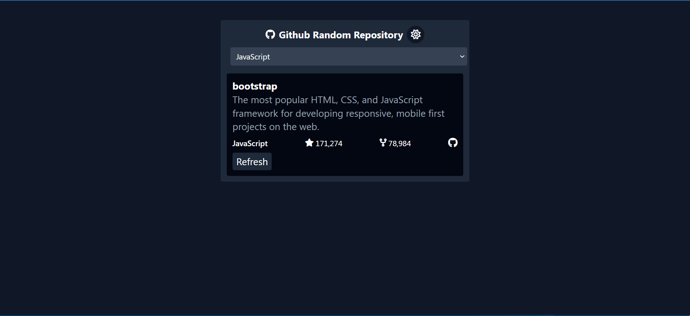

# GitHub Random Repository 🎲

A React-based web application that fetches and displays random GitHub repositories using the GitHub API.
## 📷 Screenshots



---
## 💡 Project Idea from  roadmap.sh
- [se the project idea](https://roadmap.sh/projects/github-random-repo)

## 🌟 Features

- 🔀 Fetches and displays a random GitHub repository.  
- 📄 Shows repository details like name, description, and stars.  
- 🎨 **Dark Mode support** for a better visual experience.  
- ⚡ Fetch new repositories at  select the language.  
- 📱 User-friendly and responsive UI. 

---
## 🛠 Tech Stack  

This project is built using the following technologies:

| Technology | Description |
|------------|-------------|
| ⚛ **React.js** | JavaScript library for building UI components |
| 🎨 **Tailwindcss** | Styling for the application |
| 🌙 **Dark Mode** | Theme toggling with local storage support |
| 🔥 **GitHub API** | Fetching repository data dynamically |
| 📦 **Vite** | Faster development and optimized build |

## 📦 Installation

1. Clone this repository:
   ```bash
   git clone https://github.com/shiinedev/Github-Random-Repository.git
   ```
2. Navigate to the project directory:
    ```bash 
    cd Github-Random-Repository
    ```
3. Install dependencies (if applicable):
    ```bash
    npm install
    ```
### 🚀 Usage
Run the application:
```bash
npm run dev
```

    
