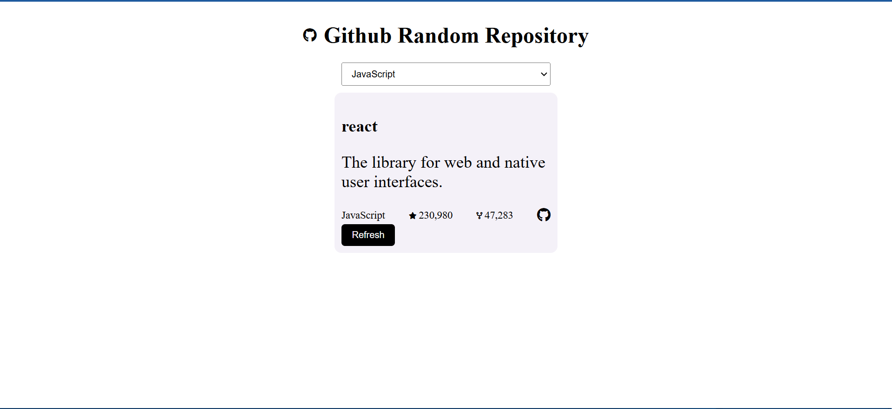

# GitHub Random Repository 🎲

A simple tool to fetch and display random GitHub repositories. Useful for discovering interesting projects!

## 📷 Screenshots



---
## 💡 Project Idea from  roadmap.sh
- [se the project idea](https://roadmap.sh/projects/github-random-repo)

## 🌟 Features

- Fetches random repositories from GitHub .
- Explore repositories by topic, stars,or languages.
- Easy-to-use interface.

---

## 📦 Installation

1. Clone this repository:
   ```bash
   git clone https://github.com/shiinedev/Github-Random-Repository.git
   ```
2. Navigate to the project directory:
    ```bash 
    cd Github-Random-Repository
    ```
3. Install dependencies (if applicable):
    ```bash
    npm install
    ```
### 🚀 Usage
Run the application:
```bash
npm run dev
```

    
